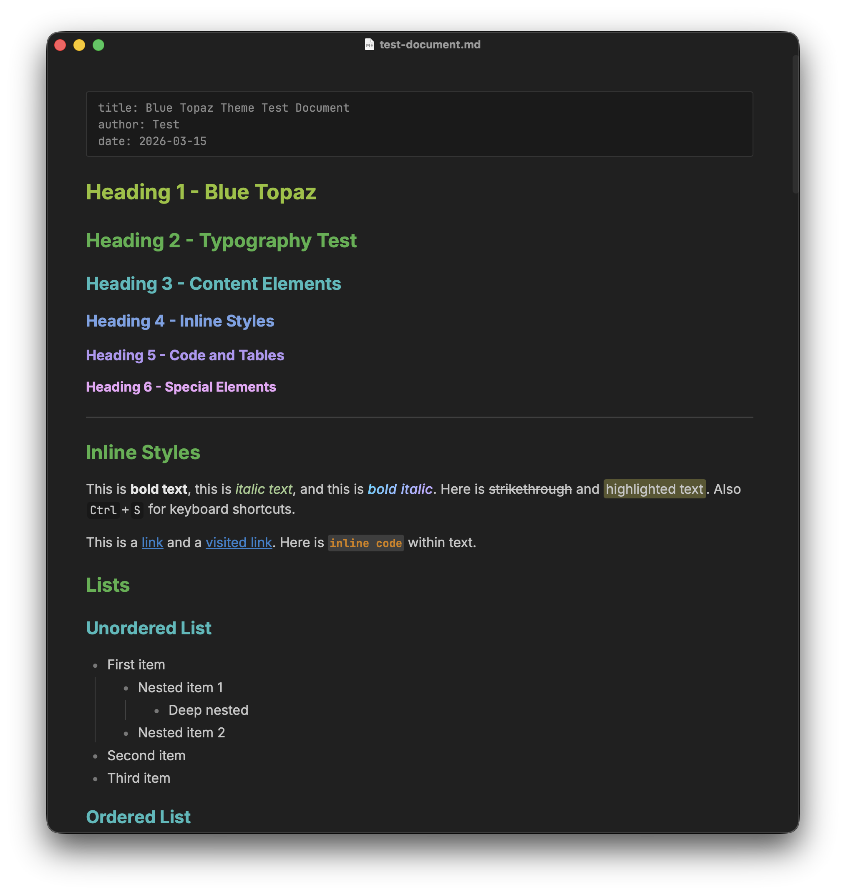
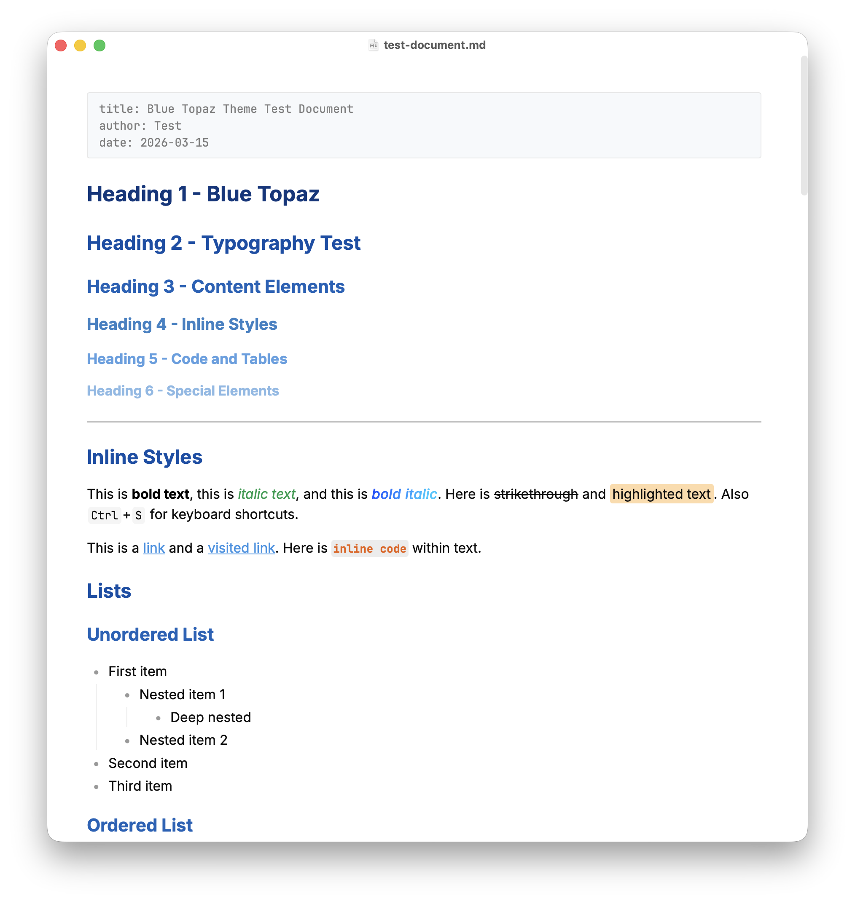

# Blue Topaz Theme for Typora

[中文版](README_CN.md) | [Typora Theme Gallery](https://theme.typora.io)

A Typora port of the popular [Blue Topaz](https://github.com/PKM-er/Blue-Topaz_Obsidian-css) Obsidian theme, featuring gradient headings, refined code highlighting, and GFM alert styling.

### Dark Mode

### Light Mode

## Features

- **Light & Dark Modes** — Two independent theme files included
- **CJK Optimized** — Inter + JetBrains Mono + Chinese font fallbacks

## Installation

1. [**Download**](https://github.com/qishaoyumu/typora-blue-topaz-theme/archive/refs/heads/master.zip) the zip and extract, or clone this repository
2. Open Typora, go to `Preferences > Appearance > Open Theme Folder`
3. Copy the following into the theme folder:
   - `blue-topaz.css`
   - `blue-topaz-dark.css`
   - `blue-topaz/` folder (fonts)
4. Restart Typora and select **Blue Topaz** or **Blue Topaz Dark** from the theme menu

## Recommended Fonts

The theme includes **Inter** (body) and **JetBrains Mono** (code). For the best Chinese text experience, install:

- [LXGW WenKai / 霞鹜文楷 GB](https://github.com/lxgw/LxgwWenKai)
  - macOS: `brew install font-lxgw-wenkai`
  - Windows: [GitHub Releases](https://github.com/lxgw/LxgwWenKai/releases)
  - Linux: `sudo apt install fonts-lxgw-wenkai` or download from Releases

Without it, the theme falls back to system fonts (PingFang SC / Microsoft YaHei / Noto Sans CJK).

## Credits

Based on [Blue Topaz](https://github.com/PKM-er/Blue-Topaz_Obsidian-css) v2025052001 by WhyI & Pkmer community. See [CREDITS.md](CREDITS.md) for details.

## License

[MIT](LICENSE)
