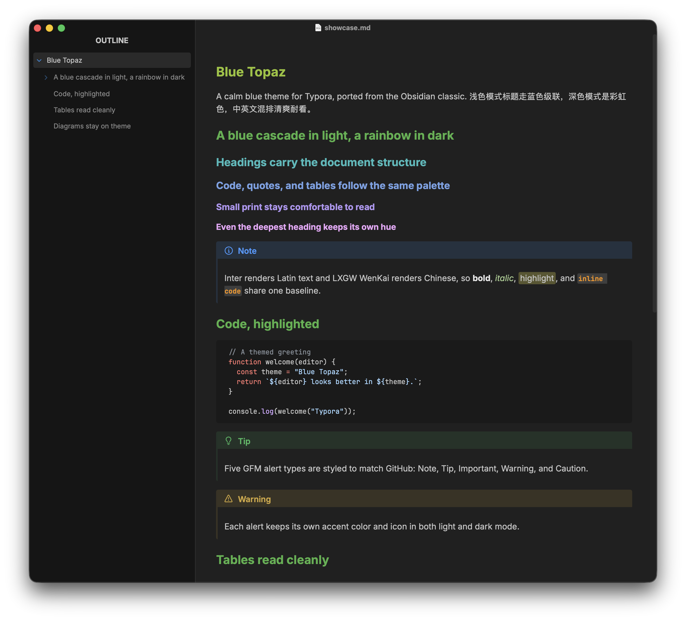
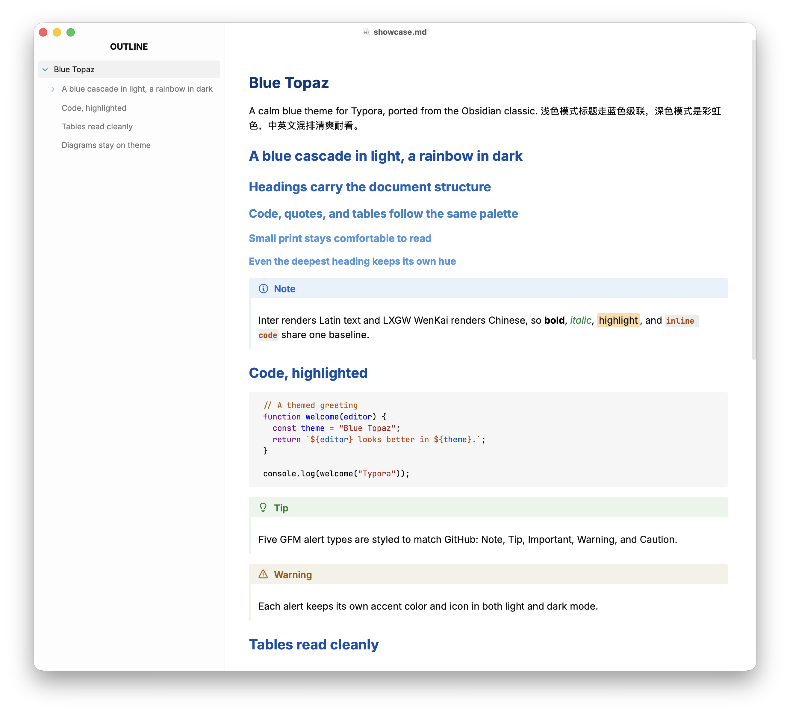

# Blue Topaz Theme for Typora

[中文版](README_CN.md) | [View in Typora Themes Gallery](https://theme.typora.io/theme/Obsidian-Blue-Topaz/)

This theme ports the [Blue Topaz](https://github.com/PKM-er/Blue-Topaz_Obsidian-css) Obsidian theme to Typora. It adds colored headings (a blue cascade in light mode, rainbow in dark), code highlighting, and GFM alert styling. If you already use Blue Topaz in Obsidian, it brings the same look to your Typora notes.

### Dark Mode

### Light Mode

## Features

- **Light and dark modes**: two theme entries share one source. `blue-topaz-dark.css` imports `blue-topaz.css`, then overrides the dark palette, code highlighting, and print styles.
- **Colored heading cascade**: a blue h1 to h6 gradient in light mode, rainbow hues in dark.
- **GFM alerts**: Note, Tip, Important, Warning, and Caution, matching GitHub.
- **Code highlighting**: `cm-s-inner` tokens are based on CodeMirror's default palette in light mode and GitHub Dark in dark mode.
- **Mermaid diagrams**: accent-blue nodes in light mode, and a dark preset with custom node, edge, and label colors in dark mode.
- **Focus mode**: dims non-focused blocks while keeping their heading and text colors.
- **Print and export**: output follows the selected theme: dark stays dark (dark surfaces, light text), and light stays light.
- **Typora UI theming**: sidebar, file tree, search, Quick Open, preferences, modals, and source mode.
- **Markdown elements**: styled tables, task lists, blockquotes, details/summary, definition lists, multi-color highlights, superscript and subscript, plus reduced-motion handling.
- **Accessibility**: high-frequency colored text (links, inline code, emphasis, headings, and alert labels) meets WCAG AA contrast.
- **Chinese text**: a CJK fallback chain with optional LXGW WenKai, alongside bundled Inter and JetBrains Mono for Latin and code.

## Installation

Requires Typora 1.13 or later (the theme relies on `:has()` and other modern CSS). Update Typora first if the theme does not appear or renders incorrectly.

1. [**Download**](https://github.com/qishaoyumu/typora-blue-topaz-theme/releases/latest) the latest release and extract it, or clone this repository.
2. Open the theme folder from Typora:
   - macOS: `Typora > Preferences > Appearance > Open Theme Folder`
   - Windows / Linux: `File > Preferences > Appearance > Open Theme Folder`
3. Copy these into the theme folder, keeping the names and layout unchanged (the dark theme imports the light one, and both load fonts from `blue-topaz/`):
   - `blue-topaz.css`
   - `blue-topaz-dark.css`
   - the entire `blue-topaz/` folder (includes `font.css`, the `.woff2` fonts, and font licenses)
4. Restart Typora, then choose **Blue Topaz** or **Blue Topaz Dark** from the **Themes** menu.

**Updating**: download the new version, replace `blue-topaz.css`, `blue-topaz-dark.css`, and the entire `blue-topaz/` folder, then restart Typora.

**Uninstalling**: switch to another theme first, then delete `blue-topaz.css`, `blue-topaz-dark.css`, and the `blue-topaz/` folder from the theme folder and restart Typora.

## Recommended Fonts

The theme bundles **Inter** for Latin body text and **JetBrains Mono** for code. Inter has no Chinese glyphs, so for Chinese text install [LXGW WenKai](https://github.com/lxgw/LxgwWenKai):

- macOS: `brew install --cask font-lxgw-wenkai` (or download the TTF and install it)
- Windows: download the latest TTF from [GitHub Releases](https://github.com/lxgw/LxgwWenKai/releases) and install it
- Debian / Ubuntu: `sudo apt install fonts-lxgw-wenkai`
- Other Linux: install your distro's package, or download the TTF and run `fc-cache -f`

Without LXGW WenKai, Chinese text falls back to the default system font (PingFang SC on macOS, Microsoft YaHei on Windows; on Linux it depends on your fontconfig setup).

## Troubleshooting

- **The theme has no styling, especially the dark one**: `blue-topaz.css` and the `blue-topaz/` folder must sit in the same theme folder as `blue-topaz-dark.css`. The dark theme imports the light one and needs both.
- **The theme is missing from the menu**: make sure the files sit directly in the theme folder, not inside a nested subfolder created when extracting the archive, then restart Typora fully (Cmd+Q on macOS), not just the window.
- **Text or layout looks wrong**: confirm Typora is 1.13 or later.
- **Exported HTML uses different fonts**: Typora removes the theme's bundled `@font-face` rules during HTML export, so text falls back to system fonts on machines without Inter or JetBrains Mono installed (document structure and colors are unaffected). This is Typora's export behavior, not a theme issue; PDF export embeds the fonts, so use PDF for reliable sharing, or ask recipients to install the fonts.

## Credits

Based on [Blue Topaz](https://github.com/PKM-er/Blue-Topaz_Obsidian-css) v2025052001 by WhyI and the Pkmer community. See [CREDITS.md](CREDITS.md) for details.

## Contributing

Issues and PRs are welcome. When opening a PR, please:

- Keep light and dark behavior in sync and update both README files together.
- Follow the existing CSS section comment style (`/* ========== Section ========== */`).
- For visual changes, attach a before/after screenshot from Typora.

## License

The theme CSS is licensed under the [MIT License](LICENSE). Bundled fonts under `blue-topaz/` use the SIL Open Font License 1.1; see [CREDITS.md](CREDITS.md).
