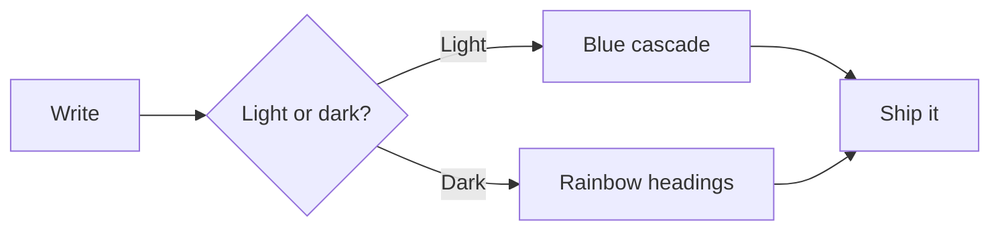

# Blue Topaz

A calm blue theme for Typora, ported from the Obsidian classic. 浅色模式标题走蓝色级联，深色模式是彩虹色，中英文混排清爽耐看。

## A blue cascade in light, a rainbow in dark

### Headings carry the document structure

#### Code, quotes, and tables follow the same palette

##### Small print stays comfortable to read

###### Even the deepest heading keeps its own hue

> [!NOTE]
> Inter renders Latin text and LXGW WenKai renders Chinese, so **bold**, *italic*, ==highlight==, and `inline code` share one baseline.

## Code, highlighted

```javascript
// A themed greeting
function welcome(editor) {
  const theme = "Blue Topaz";
  return `${editor} looks better in ${theme}.`;
}

console.log(welcome("Typora"));
```

> [!TIP]
> Five GFM alert types are styled to match GitHub: Note, Tip, Important, Warning, and Caution.

> [!WARNING]
> Each alert keeps its own accent color and icon in both light and dark mode.

## Tables read cleanly

| Element  | Light mode         | Dark mode     |
| :------- | :----------------- | :------------ |
| Headings | Blue cascade       | Rainbow       |
| Code     | CodeMirror palette | GitHub Dark   |
| Alerts   | GitHub colors      | GitHub colors |

## Diagrams stay on theme



> 蓝宝石 Blue Topaz：把 Obsidian 的经典配色带到 Typora。
