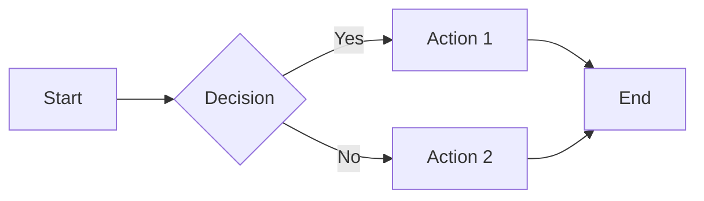

# Heading 1 - Blue Topaz

## Heading 2 - Typography Test

### Heading 3 - Content Elements

#### Heading 4 - Inline Styles

##### Heading 5 - Code and Tables

###### Heading 6 - Special Elements

---

## Inline Styles

This is **bold text**, this is *italic text*, and this is ***bold italic***. Here is ~~strikethrough~~ and ==highlighted text==. Also <kbd>Ctrl</kbd>+<kbd>S</kbd> for keyboard shortcuts.

This is a [link](https://github.com) and a [visited link](https://google.com). Here is `inline code` within text.

## Lists

### Unordered List

- First item
  - Nested item 1
    - Deep nested
  - Nested item 2
- Second item
- Third item

### Ordered List

1. First step
   1. Sub-step A
   2. Sub-step B
2. Second step
3. Third step

### Task List

- [x] Completed task
- [x] Incomplete task
- [x] Another completed task
- [x] Yet another task

## Blockquote

> This is a blockquote with some important information.
>
> > This is a nested blockquote.
> >
> > It can span multiple lines.

## Table

| Feature | Light Mode | Dark Mode |
|:--------|:----------:|----------:|
| Background | White | Dark |
| Headings | Blue gradient | Rainbow |
| Code | Orange | Amber |
| Emphasis | Green | Light green |

## Code Blocks

```javascript
function fibonacci(n) {
  if (n <= 1) return n;
  return fibonacci(n - 1) + fibonacci(n - 2);
}
console.log(fibonacci(10)); // 55
```

```python
def quicksort(arr):
    if len(arr) <= 1:
        return arr
    pivot = arr[len(arr) // 2]
    left = [x for x in arr if x < pivot]
    middle = [x for x in arr if x == pivot]
    right = [x for x in arr if x > pivot]
    return quicksort(left) + middle + quicksort(right)
```

```typescript
interface User {
  id: number;
  name: string;
  email?: string;
}

async function fetchUsers(limit: number): Promise<User[]> {
  const response = await fetch(`/api/users?limit=${limit}`);
  if (!response.ok) {
    throw new Error(`HTTP ${response.status}`);
  }
  const data: User[] = await response.json();
  return data.filter(user => user.email !== undefined);
}

const users = await fetchUsers(10);
console.log(`Found ${users.length} users`);
```

```css
:root {
  --primary-color: hsl(207, 77%, 54%);
  --bg-color: #ffffff;
}

body {
  font-family: "Inter", sans-serif;
  line-height: 1.6;
}
```

## Images


## Math

Inline math: $E = mc^2$

Block math:

$$
\int_{-\infty}^{\infty} e^{-x^2} dx = \sqrt{\pi}
$$

## Footnotes

This sentence has a footnote[^1].

## Table of Contents

[TOC]

## Mermaid Diagram



## GFM Alerts

> [!NOTE]
> This is a note alert.

> [!WARNING]
> This is a warning alert.

> [!IMPORTANT]
> This is an important alert.

> [!TIP]
> This is a tip alert.

> [!CAUTION]
> This is a caution alert.

## Chinese and English Mixed Text

Blue Topaz 是一个非常受欢迎的 Obsidian 主题，由 WhyI 和 Pkmer 社区维护。它的特点是标题使用渐变色，从深蓝到浅蓝，营造出优雅的视觉层次。

在代码方面，Blue Topaz 使用 `JetBrains Mono` 作为等宽字体，配合 `霞鹜文楷 GB` 作为中文字体，呈现出独特的排版风格。

---

*End of test document*

[^1]: This is the footnote content.

