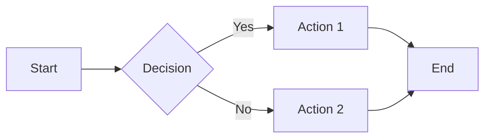

# Heading 1 - Blue Topaz

## Heading 2 - Typography Test

### Heading 3 - Content Elements

#### Heading 4 - Inline Styles

##### Heading 5 - Code and Tables

###### Heading 6 - Special Elements

---

## Inline Styles

This is **bold text**, this is *italic text*, and this is ***bold italic***. Here is ~~strikethrough~~ and ==highlighted text==. Also <kbd>Ctrl</kbd>+<kbd>S</kbd> for keyboard shortcuts.

This is a [link](https://github.com) and [another link](https://google.com). Here is `inline code` within text.

A long unbroken URL exercises word wrapping: https://example.com/a/very/long/path/segment/that/keeps/going/without/any/spaces/to/test/overflow-wrap/and/break-word/handling.

Multi-color highlight: plain ==highlight==, italic *==highlight==* (red), bold **==highlight==** (green), and bold-italic ***==highlight==*** (blue).

Superscript and subscript: x^2^ and H~2~O, plus raw <sup>sup</sup> and <sub>sub</sub>.

## Lists

### Unordered List

- First item
  - Nested item 1
    - Deep nested
  - Nested item 2
- Second item
- Third item

### Ordered List

1. First step
   1. Sub-step A
   2. Sub-step B
2. Second step
3. Third step

### Task List

- [x] Completed task
- [ ] Incomplete task
- [x] Another completed task
- [ ] Yet another task

## Blockquote

> This is a blockquote with some important information.
>
> > This is a nested blockquote.
> >
> > It can span multiple lines.

## Table

| Feature | Light Mode | Dark Mode |
|:--------|:----------:|----------:|
| Background | White | Dark |
| Headings | Blue gradient | Rainbow |
| Code | Orange | Amber |
| Emphasis | Green | Light green |

## Code Blocks

```javascript
function fibonacci(n) {
  if (n <= 1) return n;
  return fibonacci(n - 1) + fibonacci(n - 2);
}
console.log(fibonacci(10)); // 55
```

```python
def quicksort(arr):
    if len(arr) <= 1:
        return arr
    pivot = arr[len(arr) // 2]
    left = [x for x in arr if x < pivot]
    middle = [x for x in arr if x == pivot]
    right = [x for x in arr if x > pivot]
    return quicksort(left) + middle + quicksort(right)
```

```typescript
interface User {
  id: number;
  name: string;
  email?: string;
}

async function fetchUsers(limit: number): Promise<User[]> {
  const response = await fetch(`/api/users?limit=${limit}`);
  if (!response.ok) {
    throw new Error(`HTTP ${response.status}`);
  }
  const data: User[] = await response.json();
  return data.filter(user => user.email !== undefined);
}

const users = await fetchUsers(10);
console.log(`Found ${users.length} users`);
```

```css
:root {
  --primary-color: hsl(207, 77%, 54%);
  --bg-color: #ffffff;
}

body {
  font-family: "Inter", sans-serif;
  line-height: 1.6;
}
```

```bash
#!/usr/bin/env bash
set -euo pipefail

for css in blue-topaz*.css; do
  echo "Checking ${css}..."
  grep -c "var(--primary-color)" "$css" || true
done
```

## Images


## Math

Inline math: $E = mc^2$

Block math:

$$
\int_{-\infty}^{\infty} e^{-x^2} dx = \sqrt{\pi}
$$

## Footnotes

This sentence has a footnote[^1].

## Table of Contents

[TOC]

## Mermaid Diagram


```mermaid
graph LR
    A[Start] --> B{Decision}
    B -->|Yes| C[Action 1]
    B -->|No| D[Action 2]
    C --> E[End]
    D --> E
```

## GFM Alerts

> [!NOTE]
> This is a note alert.

> [!WARNING]
> This is a warning alert.

> [!IMPORTANT]
> This is an important alert.

> [!TIP]
> This is a tip alert.

> [!CAUTION]
> This is a caution alert.

> [!NOTE]
> This note embeds a blockquote, exercising `.md-alert blockquote`:
>
> > Nested quote inside an alert. On export it should stay transparent over the
> > alert body and show no black box, per the plain-transparent export rule.

## Chinese and English Mixed Text

Blue Topaz 是广受欢迎的 Obsidian 主题，由 WhyI 和 Pkmer 社区维护。浅色模式标题从深蓝到浅蓝渐变，深色模式使用彩虹色，形成清晰的视觉层次。

在代码方面，Blue Topaz 使用 `JetBrains Mono` 作为等宽字体；中文优先使用 `霞鹜文楷 GB`，未安装时回退到系统中文字体。

---

# Heading 1 - Extended Formatting

## Definition List

HTML
:   Hypertext Markup Language, the standard markup language for web pages.

CSS
:   Cascading Style Sheets, used to describe the presentation of a document.

## Nested Mixed Content

> **Note:** The following list demonstrates nested formatting combinations.
>
> 1. First item with `inline code` and **bold**
>    - Sub-item with *italic* and ~~strikethrough~~
>    - Sub-item with $x^2 + y^2 = r^2$
> 2. Second item with a [link](https://github.com)

### Deep Nesting Showcase

- Level 1
  - Level 2 contains **bold** and *italic*
    - Level 3 has `code` and ==highlight==
      - Level 4 tests the indent depth

## Collapsible Block

<details>
<summary>Click to expand hidden content</summary>

This block tests the `<details>` / `<summary>` disclosure widget, including **bold**, `inline code`, and a [link](https://github.com).

```python
print("inside a collapsible block")
```

</details>

---

*End of test document*

[^1]: This is the footnote content.

